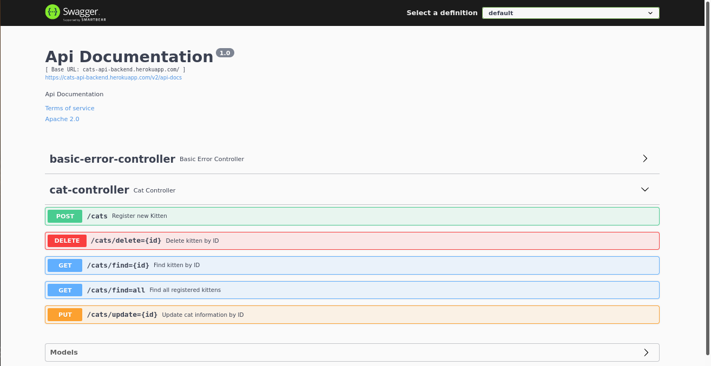
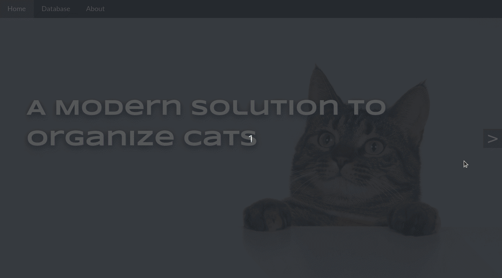
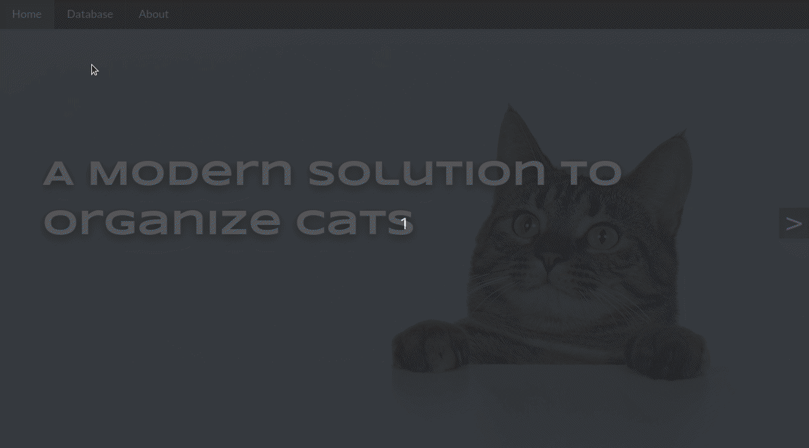
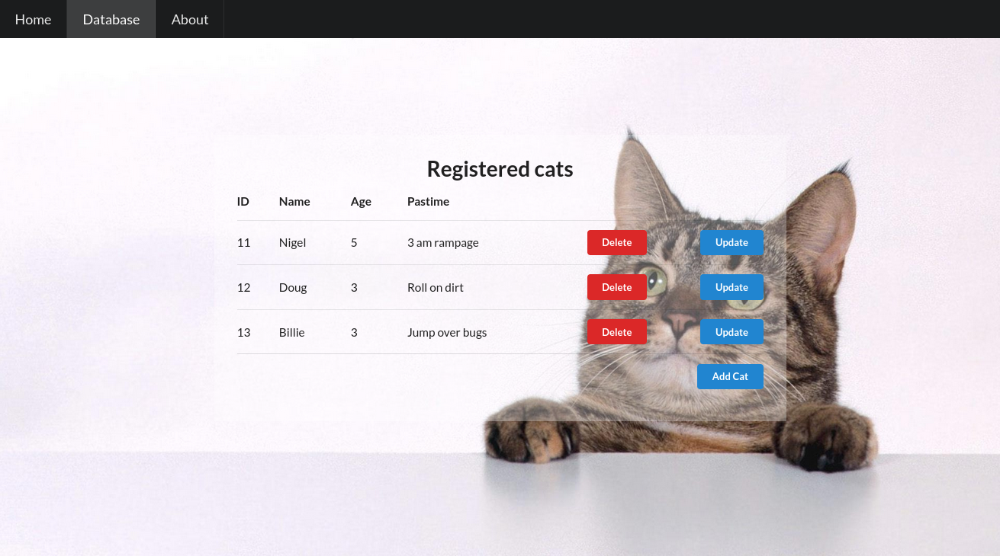
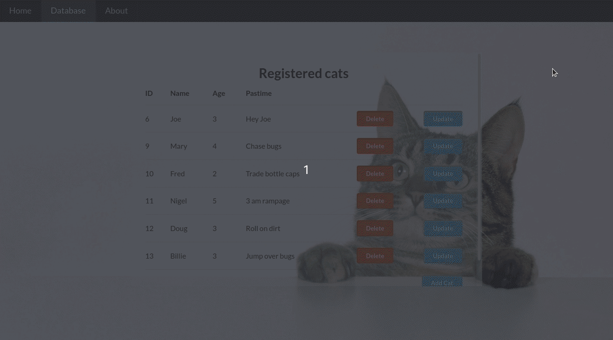
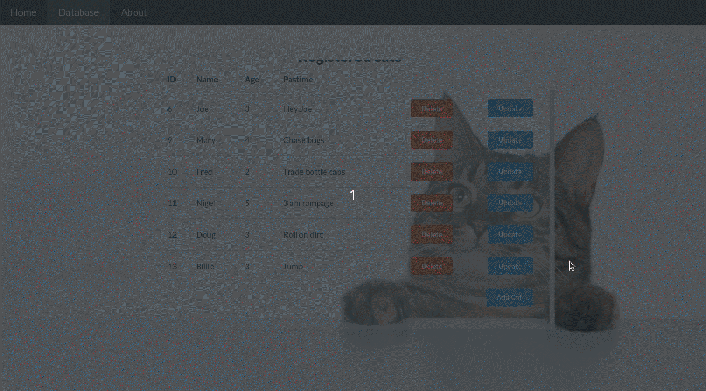
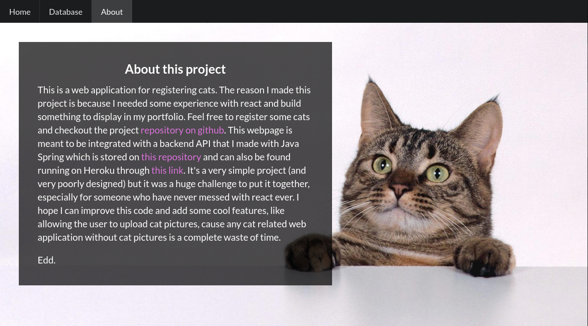

# Cat Management System

## About

This is a web application for registering cats. The reason I made this project is because I needed some experience with react and to build something to display in my portfolio.

It's a very simple project (and very poorly designed) but it was a huge challenge to put it together, especially for someone who have never messed with react ever before.

## Backend Integration

This webpage is meant to be integrated with a 
backend API that I made with Java Spring. Its souce code is available in <a href="https://github.com/oieusouoede/cats-api-backend"> this repository</a> and can also be found running on Heroku through
<a href="https://cats-api-backend.herokuapp.com/swagger-ui/"> this link</a>.

## Running it Locally

To run the applicaton locally you need to run:

### `npm install`

To install all dependencies, and then:

### `npm start`

To run the app in the development mode.\
Open [http://localhost:3000](http://localhost:3000) to view it in the browser.

## Previews

### Landing page carousel

Built using [pure-react-carousel](https://github.com/express-labs/pure-react-carousel)

### Page routing

Using [React Router](https://reactrouter.com/)

### Database page

Made using [Semantic-UI](https://react.semantic-ui.com/)

### Data deletion

All CRUD operations were implemented using [Axios](https://axios-http.com/docs/intro) and [React Query](https://react-query.tanstack.com/)

### Form Modal

I tried to implement the modal in a way I could use it for both the Create and Update operations slightly changing its behaviour.

Create:

Update:

Made with [Modal Component](https://react.semantic-ui.com/modules/modal/) from Semantic-UI

And finally, the

### About Page

## Final thoughts

The web page needs some fixing to make it responsive. I'm looking forward to improve this code and also add some cool features like allowing the user to upload cat pictures, cause any cat related web app without cat pictures is a complete waste of time.

Edd.